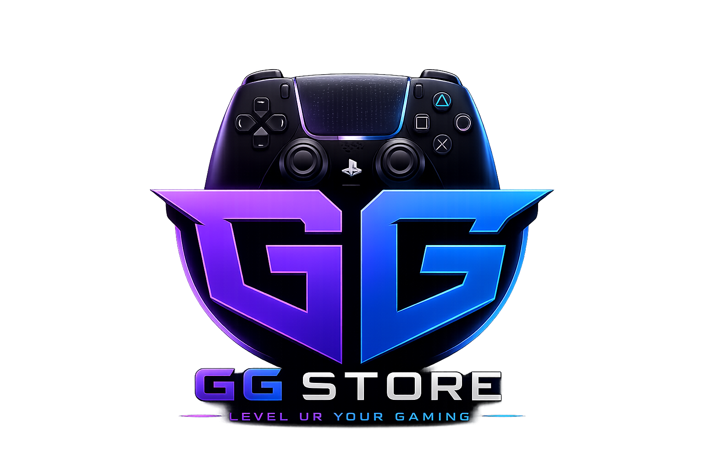
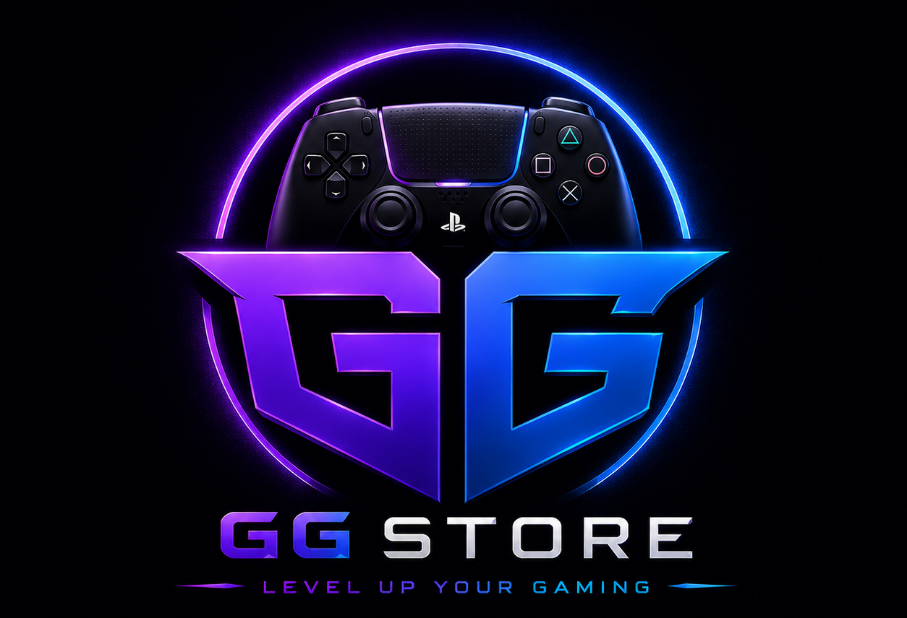

<div align="center">
  
  
  # 🎮 GG-Store — Next-Gen Digital Game Storefront

  <p align="center">
    A blazing-fast, immersive, and responsive digital gaming marketplace built with modern web technologies.
  </p>

  <p align="center">
    <a href="https://github.com/saifeldeenamr10/GG-store/stargazers"></a>
    <a href="https://github.com/saifeldeenamr10/GG-store/network/members"></a>
    <a href="https://github.com/saifeldeenamr10/GG-store/issues"></a>
    <a href="https://vitejs.dev/"></a>
    <a href="https://vercel.com/"></a>
  </p>
</div>

---

## 🌟 Key Highlights

- ⚡ **Ultra-Responsive Storefront**: High-performance UI designed with glassmorphism, micro-animations, and dynamic theme accents.
- 🔍 **Real-Time Search & Filtering**: Instant discovery by title, category, price tier, platform, and availability.
- 🌐 **Multilingual & Localized (i18n)**: Seamless language toggling with complete RTL and LTR support.
- 🎛️ **Comprehensive Admin Dashboard**: Full control over game catalog, prices, promotional banners, and inventory.
- 📱 **Mobile-First & Cross-Platform**: Optimized for desktop, tablet, and mobile screens.
- 🚀 **Zero-Bloat Architecture**: Crafted with Vanilla JavaScript, pure CSS variables, and modern bundling for sub-second load times.

---

## 📸 Screenshots

| Modern Dark Storefront | Dynamic Game Catalog |
| :---: | :---: |
|  |  |

---

## 🛠️ Built With

| Layer | Technology | Purpose |
| :--- | :--- | :--- |
| **Core** | `HTML5` + `Vanilla JavaScript (ESNext)` | Lightweight and performant client logic |
| **Styling** | `CSS3` (Custom Properties, Flexbox, Grid) | Custom fluid design system & themes |
| **Tooling** | [Vite](https://vitejs.dev/) | Next-generation frontend tooling and HMR |
| **Deployment** | [Vercel](https://vercel.com/) | Global edge delivery and lightning-fast CDN |

---

## 📂 Project Architecture

```
GG-store/
├── 📁 public/
│   ├── 📁 assets/
│   │   ├── 📁 image of the games/    # Game cover art and promotional media
│   │   └── logo.png                  # Brand identity assets
│   └── 📁 data/
│       └── games.json                # Game catalog database
├── 📁 src/
│   ├── 📁 js/
│   │   ├── admin.js                  # Management dashboard logic
│   │   ├── data.js                   # Catalog state & data fetching
│   │   ├── i18n.js                   # Internationalization engine
│   │   ├── main.js                   # Application bootstrap
│   │   ├── router.js                 # SPA view routing
│   │   └── views.js                  # Dynamic UI renderers
│   └── 📁 styles/
│       ├── animations.css            # Smooth transition keyframes
│       ├── components.css            # Reusable UI component modules
│       ├── layout.css                # Page scaffolding & grids
│       ├── main.css                  # Core global styles
│       ├── responsive.css            # Viewport media queries
│       └── variables.css             # Theme design tokens & palettes
├── index.html                        # Main application entry
├── package.json                      # Project dependencies & build scripts
├── update_data.js                    # Catalog utility script
└── vite.config.js                    # Vite configuration & dev server mock API
```

---

## 🚀 Quick Start

Follow these simple steps to run GG-Store locally on your machine:

### 1. Prerequisites
- **Node.js** (v18.0.0 or higher recommended)
- **npm** (v9.0.0 or higher) or **pnpm** / **yarn**

### 2. Clone & Install

```bash
# Clone the repository
git clone https://github.com/saifeldeenamr10/GG-store.git

# Enter project directory
cd GG-store

# Install all dependencies
npm install
```

### 3. Launch Development Server

```bash
npm run dev
```
Open your browser at `http://localhost:5173/` to explore the store.

### 4. Build for Production

```bash
npm run build
```
Production assets will be generated in the `/dist` directory.

---

## 🚢 Deployment (Vercel)

GG-Store is optimized for instant one-click deployment on **Vercel**:

1. Push your repository to GitHub.
2. Import the project into your [Vercel Dashboard](https://vercel.com/new).
3. Vercel will automatically detect **Vite** configuration.
4. Click **Deploy**!

---

## 🤝 Contributing

Contributions, feature suggestions, and feedback are always welcome!

1. Fork the Project (`https://github.com/saifeldeenamr10/GG-store/fork`)
2. Create your Feature Branch (`git checkout -b feature/AmazingFeature`)
3. Commit your Changes (`git commit -m 'Add some AmazingFeature'`)
4. Push to the Branch (`git push origin feature/AmazingFeature`)
5. Open a Pull Request

---

## 📄 License

This project is licensed under the **MIT License** — see the [LICENSE](LICENSE) file for details.

---

<div align="center">
  Crafted with ❤️ by <a href="https://github.com/saifeldeenamr10"><strong>Saifeldeen Amr</strong></a>
</div>
